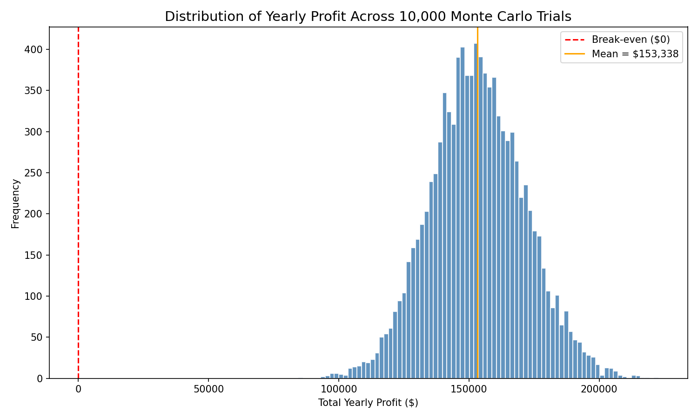
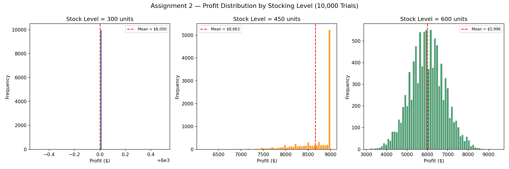
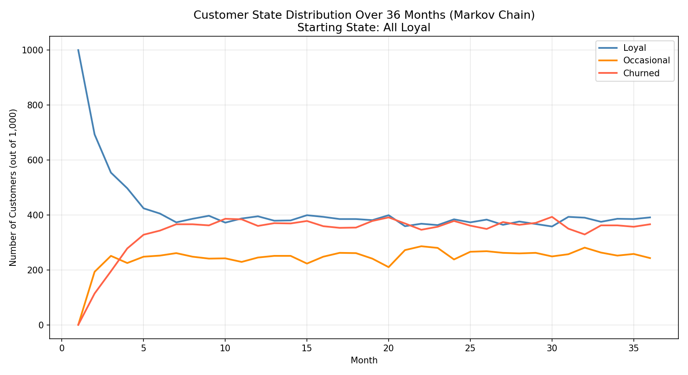
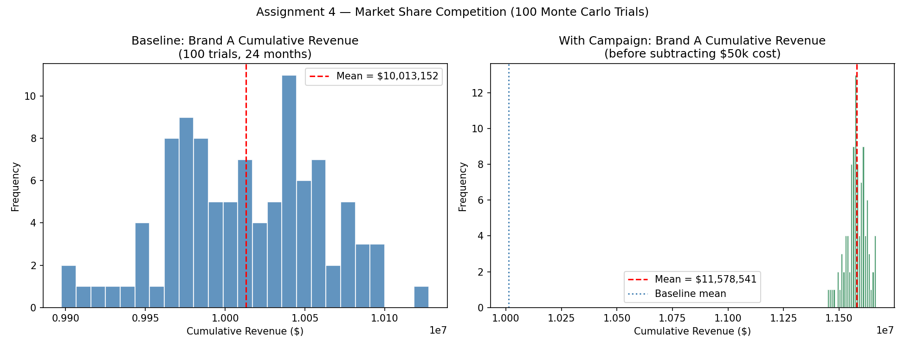

# Computer-modeling-simulations
Monte Carlo and Markov Chain simulations modelling business scenarios — built for a Computer Modeling &amp; Simulation course

# 📊 Computer Modeling & Simulation

A collection of simulation assignments from CS 351 — Computer Modeling & Simulation at Brescia University. Each project models a real-world business or economic scenario using Monte Carlo methods, Markov Chains, and stochastic simulation.

---

## 🗂️ Assignments Overview

| # | File | Topic | Techniques |
|---|---|---|---|
| 1 | `startup_revenue.py` | Startup Revenue Risk | Monte Carlo, Normal & Uniform distributions |
| 2 | `inventory_risk.py` | Inventory Risk Management | Monte Carlo, Poisson distribution |
| 3 | `markov_loyalty.py` | Customer Loyalty Dynamics | Markov Chains, state transitions |
| 4 | `market_share.py` | Market Share Competition | Markov Chains + Monte Carlo combined |

---

## 📁 Assignment Details

### Assignment 1 — Startup Revenue Risk
Simulates 10,000 trials of a startup's first year, modelling monthly customer acquisition (Normal distribution) and churn (Uniform distribution) to estimate the probability of profitability.

**Key output:** Probability of yearly profit > $0 and 5th-percentile worst-case scenario.

### Assignment 2 — Inventory Risk Management
Uses Monte Carlo simulation with Poisson-distributed daily demand to compare three stocking strategies (300, 450, 600 units) over 30 days across 10,000 trials.

**Key output:** Profit distribution, expected value, and probability of loss per stocking level.

### Assignment 3 — Customer Loyalty Dynamics
Models 1,000 customers transitioning between Loyal, Occasional, and Churned states over 36 months using a Markov Chain. Verifies the memoryless property by testing two different starting conditions.

**Key output:** Monthly state distribution and steady-state convergence regardless of starting state.

### Assignment 4 — Market Share Competition
Combines Markov Chains and Monte Carlo to simulate brand competition between three companies over 24 months. Evaluates whether a $50,000 marketing campaign generates positive ROI for Brand A.

**Key output:** Revenue lift, net gain after campaign cost, and probability that the campaign underperforms the baseline.

---

## 📸 Sample Outputs

### Assignment 1 — Startup Revenue Distribution


### Assignment 2 — Inventory Profit by Stocking Level


### Assignment 3 — Customer Loyalty Over 36 Months


### Assignment 4 — Market Share Campaign Analysis


---

## 🚀 How to Run

**Clone the repository:**
```bash
git clone https://github.com/VelosoMiguel/computer-modeling-simulations.git
cd computer-modeling-simulations
```

**Install dependencies:**
```bash
pip install -r requirements.txt
```

**Run any assignment:**
```bash
python assignment1_startup_revenue.py
python assignment2_inventory_risk.py
python assignment3_markov_loyalty.py
python assignment4_market_share.py
```

Each script prints key statistics to the terminal and saves a chart as a `.png` file.

---

## 🛠️ Built With

- **Python** — core language
- **NumPy** — numerical operations and random distributions
- **Matplotlib** — result visualizations
- **statistics** — descriptive statistics 

---

## 🔮 Future Improvements

- [ ] Combine all assignments into an interactive Jupyter notebook
- [ ] Add sensitivity analysis to test how parameter changes affect outcomes
- [ ] Extend Assignment 4 with multiple competing campaigns
- [ ] Add confidence intervals to all Monte Carlo outputs

---

## 👤 Author

**Miguel Veloso**  
[GitHub](https://github.com/VelosoMiguel) · [LinkedIn](https://www.linkedin.com/in/miguel-veloso-91355b372/)
